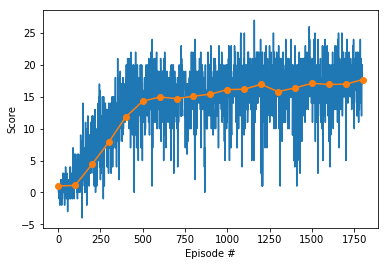
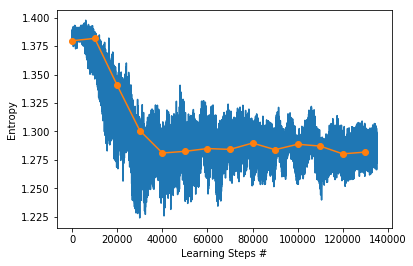
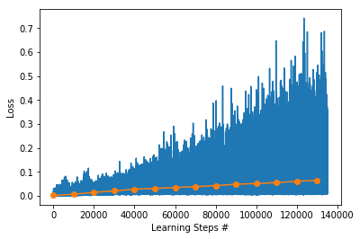
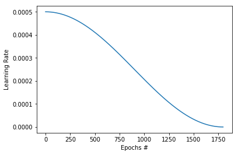

## Learning Algorithm

The current solution implements a Dueling DDQN algorithm with Prioritized Experience Replay.
At the heart of the algorithm lies a neural network structured as follow:

```
DuelQNetwork(
  (input): Linear(in_features=37, out_features=100, bias=True)
  (dropout): Dropout(p=0.3)
  (hidden): ModuleList(
    (0): Linear(in_features=100, out_features=64, bias=True)
    (1): Linear(in_features=64, out_features=64, bias=True)
    (2): Linear(in_features=64, out_features=64, bias=True)
    (3): Linear(in_features=64, out_features=64, bias=True)
  )
  (value): ModuleList(
    (0): Linear(in_features=64, out_features=64, bias=True)
    (1): Linear(in_features=64, out_features=1, bias=True)
  )
  (advantage): ModuleList(
    (0): Linear(in_features=64, out_features=64, bias=True)
    (1): Linear(in_features=64, out_features=4, bias=True)
  )
)
```

## Attempts, Results and possible improvements

The choosen activation function is a ReLU, which is applied between each layer with the exception of the last layer of advantage and value heads.

The goal set of the agent is to reach +13 points as average reward of the last 100 episodes.  
The current solution manages to reach the goal after 400-500 episodes and keep improving over 17 points.  
Have been proven very useful the cosine learning rate annealing, to reduce the bouncing in score.  
Other forms of learning rate annealing have been tested, like the exponential however it doesn't yield as good results.  
Probably a well tuned multi step annealing can yield even better results.  
Another good option which I didn't had the time to test is SGD with Warm Restart, as it would help to leave local minimas.  

Unfortunately, even if I've been implementing Prioritized Experience Replay for the final training I've decided to disable it via Hyperparameters (see "priority" and "weight_importance")
The reason is that it was showing a very good speedup in the early phase of training, but it was becoming a quite limiting factor in the later phase of training.
As it shown quite good results it would be probably worth been added back with appropriate hyperparameter, but I had limited time to further explore this opportunity. 

Here the history of the training, results are printed every 10 Epochs, but values are averaged over last 100 episodes.  









Training history details: 

```
EP: 0/1800 - Score: 1.00 - Entropy: 1.38469 - Loss: 0.00533 - EPS: 0.99 - LR: 5.000e-04 - Pri: 0.000 - WI:0.000
EP: 10/1800 - Score: 0.00 - Entropy: 1.38612 - Loss: 0.00244 - EPS: 0.90 - LR: 5.000e-04 - Pri: 0.000 - WI:0.000
EP: 20/1800 - Score: 0.05 - Entropy: 1.38609 - Loss: 0.00333 - EPS: 0.81 - LR: 4.998e-04 - Pri: 0.000 - WI:0.000
EP: 30/1800 - Score: 0.29 - Entropy: 1.38623 - Loss: 0.00354 - EPS: 0.73 - LR: 4.997e-04 - Pri: 0.000 - WI:0.000
EP: 40/1800 - Score: 0.20 - Entropy: 1.38590 - Loss: 0.00362 - EPS: 0.66 - LR: 4.994e-04 - Pri: 0.000 - WI:0.000
EP: 50/1800 - Score: 0.45 - Entropy: 1.38597 - Loss: 0.00601 - EPS: 0.60 - LR: 4.990e-04 - Pri: 0.000 - WI:0.000
EP: 60/1800 - Score: 0.51 - Entropy: 1.38544 - Loss: 0.00567 - EPS: 0.54 - LR: 4.986e-04 - Pri: 0.000 - WI:0.000
EP: 70/1800 - Score: 0.56 - Entropy: 1.38409 - Loss: 0.01028 - EPS: 0.49 - LR: 4.981e-04 - Pri: 0.000 - WI:0.000
EP: 80/1800 - Score: 0.70 - Entropy: 1.38313 - Loss: 0.00989 - EPS: 0.44 - LR: 4.976e-04 - Pri: 0.000 - WI:0.000
EP: 90/1800 - Score: 0.86 - Entropy: 1.38073 - Loss: 0.01012 - EPS: 0.40 - LR: 4.969e-04 - Pri: 0.000 - WI:0.000
EP: 100/1800 - Score: 1.13 - Entropy: 1.37629 - Loss: 0.01038 - EPS: 0.36 - LR: 4.962e-04 - Pri: 0.000 - WI:0.000
EP: 110/1800 - Score: 1.40 - Entropy: 1.37509 - Loss: 0.00830 - EPS: 0.33 - LR: 4.954e-04 - Pri: 0.000 - WI:0.000
EP: 120/1800 - Score: 1.67 - Entropy: 1.37451 - Loss: 0.00728 - EPS: 0.30 - LR: 4.945e-04 - Pri: 0.000 - WI:0.000
EP: 130/1800 - Score: 1.86 - Entropy: 1.37165 - Loss: 0.00886 - EPS: 0.27 - LR: 4.936e-04 - Pri: 0.000 - WI:0.000
EP: 140/1800 - Score: 2.30 - Entropy: 1.37005 - Loss: 0.01132 - EPS: 0.24 - LR: 4.926e-04 - Pri: 0.000 - WI:0.000
EP: 150/1800 - Score: 2.61 - Entropy: 1.36059 - Loss: 0.01017 - EPS: 0.22 - LR: 4.915e-04 - Pri: 0.000 - WI:0.000
EP: 160/1800 - Score: 2.83 - Entropy: 1.35843 - Loss: 0.01116 - EPS: 0.20 - LR: 4.903e-04 - Pri: 0.000 - WI:0.000
EP: 170/1800 - Score: 3.21 - Entropy: 1.35293 - Loss: 0.01168 - EPS: 0.18 - LR: 4.891e-04 - Pri: 0.000 - WI:0.000
EP: 180/1800 - Score: 3.73 - Entropy: 1.34604 - Loss: 0.01645 - EPS: 0.16 - LR: 4.878e-04 - Pri: 0.000 - WI:0.000
EP: 190/1800 - Score: 4.03 - Entropy: 1.34399 - Loss: 0.01481 - EPS: 0.15 - LR: 4.864e-04 - Pri: 0.000 - WI:0.000
EP: 200/1800 - Score: 4.43 - Entropy: 1.33310 - Loss: 0.01422 - EPS: 0.13 - LR: 4.849e-04 - Pri: 0.000 - WI:0.000
EP: 210/1800 - Score: 4.82 - Entropy: 1.32872 - Loss: 0.01742 - EPS: 0.12 - LR: 4.834e-04 - Pri: 0.000 - WI:0.000
EP: 220/1800 - Score: 5.24 - Entropy: 1.32822 - Loss: 0.01753 - EPS: 0.11 - LR: 4.818e-04 - Pri: 0.000 - WI:0.000
EP: 230/1800 - Score: 5.37 - Entropy: 1.32973 - Loss: 0.01591 - EPS: 0.10 - LR: 4.801e-04 - Pri: 0.000 - WI:0.000
EP: 240/1800 - Score: 5.74 - Entropy: 1.33510 - Loss: 0.01245 - EPS: 0.09 - LR: 4.784e-04 - Pri: 0.000 - WI:0.000
EP: 250/1800 - Score: 6.21 - Entropy: 1.32102 - Loss: 0.01557 - EPS: 0.08 - LR: 4.766e-04 - Pri: 0.000 - WI:0.000
EP: 260/1800 - Score: 6.74 - Entropy: 1.31719 - Loss: 0.01597 - EPS: 0.07 - LR: 4.747e-04 - Pri: 0.000 - WI:0.000
EP: 270/1800 - Score: 7.09 - Entropy: 1.31445 - Loss: 0.01491 - EPS: 0.07 - LR: 4.728e-04 - Pri: 0.000 - WI:0.000
EP: 280/1800 - Score: 7.38 - Entropy: 1.31722 - Loss: 0.01775 - EPS: 0.06 - LR: 4.707e-04 - Pri: 0.000 - WI:0.000
EP: 290/1800 - Score: 7.88 - Entropy: 1.31413 - Loss: 0.01761 - EPS: 0.05 - LR: 4.687e-04 - Pri: 0.000 - WI:0.000
EP: 300/1800 - Score: 7.95 - Entropy: 1.31659 - Loss: 0.01903 - EPS: 0.05 - LR: 4.665e-04 - Pri: 0.000 - WI:0.000
EP: 310/1800 - Score: 8.27 - Entropy: 1.31707 - Loss: 0.01768 - EPS: 0.04 - LR: 4.643e-04 - Pri: 0.000 - WI:0.000
EP: 320/1800 - Score: 8.42 - Entropy: 1.32116 - Loss: 0.01849 - EPS: 0.04 - LR: 4.620e-04 - Pri: 0.000 - WI:0.000
EP: 330/1800 - Score: 9.00 - Entropy: 1.31972 - Loss: 0.02096 - EPS: 0.04 - LR: 4.597e-04 - Pri: 0.000 - WI:0.000
EP: 340/1800 - Score: 9.55 - Entropy: 1.30117 - Loss: 0.02162 - EPS: 0.03 - LR: 4.573e-04 - Pri: 0.000 - WI:0.000
EP: 350/1800 - Score: 9.65 - Entropy: 1.30322 - Loss: 0.02289 - EPS: 0.03 - LR: 4.548e-04 - Pri: 0.000 - WI:0.000
EP: 360/1800 - Score: 10.06 - Entropy: 1.28582 - Loss: 0.02451 - EPS: 0.03 - LR: 4.523e-04 - Pri: 0.000 - WI:0.000
EP: 370/1800 - Score: 10.50 - Entropy: 1.27193 - Loss: 0.02179 - EPS: 0.02 - LR: 4.497e-04 - Pri: 0.000 - WI:0.000
EP: 380/1800 - Score: 10.83 - Entropy: 1.27634 - Loss: 0.02395 - EPS: 0.02 - LR: 4.470e-04 - Pri: 0.000 - WI:0.000
EP: 390/1800 - Score: 11.24 - Entropy: 1.28994 - Loss: 0.02690 - EPS: 0.02 - LR: 4.443e-04 - Pri: 0.000 - WI:0.000
EP: 400/1800 - Score: 11.91 - Entropy: 1.27608 - Loss: 0.02559 - EPS: 0.02 - LR: 4.415e-04 - Pri: 0.000 - WI:0.000
EP: 410/1800 - Score: 12.48 - Entropy: 1.28018 - Loss: 0.02940 - EPS: 0.02 - LR: 4.387e-04 - Pri: 0.000 - WI:0.000
EP: 420/1800 - Score: 13.18 - Entropy: 1.27554 - Loss: 0.02690 - EPS: 0.01 - LR: 4.358e-04 - Pri: 0.000 - WI:0.000
Saving Checkpoint: checkpoint_1534813065-ep_420-score_13.180.pth
EP: 430/1800 - Score: 13.69 - Entropy: 1.26901 - Loss: 0.02810 - EPS: 0.01 - LR: 4.328e-04 - Pri: 0.000 - WI:0.000
Saving Checkpoint: checkpoint_1534813065-ep_430-score_13.690.pth
EP: 440/1800 - Score: 13.60 - Entropy: 1.27068 - Loss: 0.02941 - EPS: 0.01 - LR: 4.298e-04 - Pri: 0.000 - WI:0.000
EP: 450/1800 - Score: 13.91 - Entropy: 1.27592 - Loss: 0.02852 - EPS: 0.01 - LR: 4.268e-04 - Pri: 0.000 - WI:0.000
Saving Checkpoint: checkpoint_1534813065-ep_450-score_13.910.pth
EP: 460/1800 - Score: 14.15 - Entropy: 1.28123 - Loss: 0.02618 - EPS: 0.01 - LR: 4.237e-04 - Pri: 0.000 - WI:0.000
Saving Checkpoint: checkpoint_1534813065-ep_460-score_14.150.pth
EP: 470/1800 - Score: 14.42 - Entropy: 1.28973 - Loss: 0.02883 - EPS: 0.01 - LR: 4.205e-04 - Pri: 0.000 - WI:0.000
Saving Checkpoint: checkpoint_1534813065-ep_470-score_14.420.pth
EP: 480/1800 - Score: 14.31 - Entropy: 1.28295 - Loss: 0.02555 - EPS: 0.01 - LR: 4.173e-04 - Pri: 0.000 - WI:0.000
EP: 490/1800 - Score: 14.43 - Entropy: 1.28576 - Loss: 0.02823 - EPS: 0.01 - LR: 4.140e-04 - Pri: 0.000 - WI:0.000
Saving Checkpoint: checkpoint_1534813065-ep_490-score_14.430.pth
EP: 500/1800 - Score: 14.24 - Entropy: 1.28829 - Loss: 0.02769 - EPS: 0.01 - LR: 4.107e-04 - Pri: 0.000 - WI:0.000
EP: 510/1800 - Score: 14.06 - Entropy: 1.28757 - Loss: 0.03111 - EPS: 0.01 - LR: 4.073e-04 - Pri: 0.000 - WI:0.000
EP: 520/1800 - Score: 13.93 - Entropy: 1.27018 - Loss: 0.02837 - EPS: 0.01 - LR: 4.039e-04 - Pri: 0.000 - WI:0.000
EP: 530/1800 - Score: 14.01 - Entropy: 1.27832 - Loss: 0.02721 - EPS: 0.01 - LR: 4.005e-04 - Pri: 0.000 - WI:0.000
EP: 540/1800 - Score: 14.18 - Entropy: 1.27778 - Loss: 0.03185 - EPS: 0.01 - LR: 3.969e-04 - Pri: 0.000 - WI:0.000
EP: 550/1800 - Score: 14.44 - Entropy: 1.27046 - Loss: 0.03306 - EPS: 0.01 - LR: 3.934e-04 - Pri: 0.000 - WI:0.000
Saving Checkpoint: checkpoint_1534813065-ep_550-score_14.440.pth
EP: 560/1800 - Score: 14.32 - Entropy: 1.28463 - Loss: 0.02750 - EPS: 0.01 - LR: 3.898e-04 - Pri: 0.000 - WI:0.000
EP: 570/1800 - Score: 14.39 - Entropy: 1.28986 - Loss: 0.03028 - EPS: 0.01 - LR: 3.862e-04 - Pri: 0.000 - WI:0.000
EP: 580/1800 - Score: 14.77 - Entropy: 1.27294 - Loss: 0.02730 - EPS: 0.01 - LR: 3.825e-04 - Pri: 0.000 - WI:0.000
Saving Checkpoint: checkpoint_1534813065-ep_580-score_14.770.pth
EP: 590/1800 - Score: 14.78 - Entropy: 1.28721 - Loss: 0.02910 - EPS: 0.01 - LR: 3.788e-04 - Pri: 0.000 - WI:0.000
Saving Checkpoint: checkpoint_1534813065-ep_590-score_14.780.pth
EP: 600/1800 - Score: 14.98 - Entropy: 1.28376 - Loss: 0.03269 - EPS: 0.01 - LR: 3.750e-04 - Pri: 0.000 - WI:0.000
Saving Checkpoint: checkpoint_1534813065-ep_600-score_14.980.pth
EP: 610/1800 - Score: 15.11 - Entropy: 1.27390 - Loss: 0.02901 - EPS: 0.01 - LR: 3.712e-04 - Pri: 0.000 - WI:0.000
Saving Checkpoint: checkpoint_1534813065-ep_610-score_15.110.pth
EP: 620/1800 - Score: 15.20 - Entropy: 1.28185 - Loss: 0.02638 - EPS: 0.01 - LR: 3.674e-04 - Pri: 0.000 - WI:0.000
Saving Checkpoint: checkpoint_1534813065-ep_620-score_15.200.pth
EP: 630/1800 - Score: 15.14 - Entropy: 1.28999 - Loss: 0.02784 - EPS: 0.01 - LR: 3.635e-04 - Pri: 0.000 - WI:0.000
EP: 640/1800 - Score: 15.05 - Entropy: 1.29514 - Loss: 0.02956 - EPS: 0.01 - LR: 3.596e-04 - Pri: 0.000 - WI:0.000
EP: 650/1800 - Score: 14.95 - Entropy: 1.29339 - Loss: 0.03032 - EPS: 0.01 - LR: 3.557e-04 - Pri: 0.000 - WI:0.000
EP: 660/1800 - Score: 15.16 - Entropy: 1.29518 - Loss: 0.03394 - EPS: 0.01 - LR: 3.517e-04 - Pri: 0.000 - WI:0.000
EP: 670/1800 - Score: 15.07 - Entropy: 1.27957 - Loss: 0.03172 - EPS: 0.01 - LR: 3.477e-04 - Pri: 0.000 - WI:0.000
EP: 680/1800 - Score: 15.04 - Entropy: 1.27622 - Loss: 0.03882 - EPS: 0.01 - LR: 3.437e-04 - Pri: 0.000 - WI:0.000
EP: 690/1800 - Score: 14.81 - Entropy: 1.27461 - Loss: 0.02762 - EPS: 0.01 - LR: 3.396e-04 - Pri: 0.000 - WI:0.000
EP: 700/1800 - Score: 14.69 - Entropy: 1.28016 - Loss: 0.03809 - EPS: 0.01 - LR: 3.355e-04 - Pri: 0.000 - WI:0.000
EP: 710/1800 - Score: 14.48 - Entropy: 1.28881 - Loss: 0.03496 - EPS: 0.01 - LR: 3.314e-04 - Pri: 0.000 - WI:0.000
EP: 720/1800 - Score: 14.59 - Entropy: 1.28640 - Loss: 0.03783 - EPS: 0.01 - LR: 3.273e-04 - Pri: 0.000 - WI:0.000
EP: 730/1800 - Score: 14.76 - Entropy: 1.27782 - Loss: 0.04230 - EPS: 0.01 - LR: 3.231e-04 - Pri: 0.000 - WI:0.000
EP: 740/1800 - Score: 15.01 - Entropy: 1.28192 - Loss: 0.04226 - EPS: 0.01 - LR: 3.189e-04 - Pri: 0.000 - WI:0.000
EP: 750/1800 - Score: 15.00 - Entropy: 1.28042 - Loss: 0.03255 - EPS: 0.01 - LR: 3.147e-04 - Pri: 0.000 - WI:0.000
EP: 760/1800 - Score: 14.94 - Entropy: 1.29103 - Loss: 0.03849 - EPS: 0.01 - LR: 3.105e-04 - Pri: 0.000 - WI:0.000
EP: 770/1800 - Score: 14.70 - Entropy: 1.30009 - Loss: 0.03699 - EPS: 0.01 - LR: 3.062e-04 - Pri: 0.000 - WI:0.000
EP: 780/1800 - Score: 14.71 - Entropy: 1.29626 - Loss: 0.03514 - EPS: 0.01 - LR: 3.020e-04 - Pri: 0.000 - WI:0.000
EP: 790/1800 - Score: 14.87 - Entropy: 1.29209 - Loss: 0.03824 - EPS: 0.01 - LR: 2.977e-04 - Pri: 0.000 - WI:0.000
EP: 800/1800 - Score: 15.11 - Entropy: 1.28244 - Loss: 0.03425 - EPS: 0.01 - LR: 2.934e-04 - Pri: 0.000 - WI:0.000
EP: 810/1800 - Score: 15.25 - Entropy: 1.29280 - Loss: 0.03495 - EPS: 0.01 - LR: 2.891e-04 - Pri: 0.000 - WI:0.000
Saving Checkpoint: checkpoint_1534813065-ep_810-score_15.250.pth
EP: 820/1800 - Score: 15.27 - Entropy: 1.29513 - Loss: 0.03292 - EPS: 0.01 - LR: 2.848e-04 - Pri: 0.000 - WI:0.000
Saving Checkpoint: checkpoint_1534813065-ep_820-score_15.270.pth
EP: 830/1800 - Score: 15.21 - Entropy: 1.28770 - Loss: 0.03867 - EPS: 0.01 - LR: 2.805e-04 - Pri: 0.000 - WI:0.000
EP: 840/1800 - Score: 15.28 - Entropy: 1.28371 - Loss: 0.03630 - EPS: 0.01 - LR: 2.761e-04 - Pri: 0.000 - WI:0.000
Saving Checkpoint: checkpoint_1534813065-ep_840-score_15.280.pth
EP: 850/1800 - Score: 15.38 - Entropy: 1.27517 - Loss: 0.03139 - EPS: 0.01 - LR: 2.718e-04 - Pri: 0.000 - WI:0.000
Saving Checkpoint: checkpoint_1534813065-ep_850-score_15.380.pth
EP: 860/1800 - Score: 15.55 - Entropy: 1.26781 - Loss: 0.04171 - EPS: 0.01 - LR: 2.674e-04 - Pri: 0.000 - WI:0.000
Saving Checkpoint: checkpoint_1534813065-ep_860-score_15.550.pth
EP: 870/1800 - Score: 15.48 - Entropy: 1.27356 - Loss: 0.03978 - EPS: 0.01 - LR: 2.631e-04 - Pri: 0.000 - WI:0.000
EP: 880/1800 - Score: 15.30 - Entropy: 1.26595 - Loss: 0.03791 - EPS: 0.01 - LR: 2.587e-04 - Pri: 0.000 - WI:0.000
EP: 890/1800 - Score: 15.50 - Entropy: 1.28707 - Loss: 0.03459 - EPS: 0.01 - LR: 2.544e-04 - Pri: 0.000 - WI:0.000
EP: 900/1800 - Score: 15.39 - Entropy: 1.29604 - Loss: 0.04772 - EPS: 0.01 - LR: 2.500e-04 - Pri: 0.000 - WI:0.000
EP: 910/1800 - Score: 15.75 - Entropy: 1.28886 - Loss: 0.04156 - EPS: 0.01 - LR: 2.456e-04 - Pri: 0.000 - WI:0.000
Saving Checkpoint: checkpoint_1534813065-ep_910-score_15.750.pth
EP: 920/1800 - Score: 15.57 - Entropy: 1.29324 - Loss: 0.04312 - EPS: 0.01 - LR: 2.413e-04 - Pri: 0.000 - WI:0.000
EP: 930/1800 - Score: 15.70 - Entropy: 1.28909 - Loss: 0.03951 - EPS: 0.01 - LR: 2.369e-04 - Pri: 0.000 - WI:0.000
EP: 940/1800 - Score: 15.59 - Entropy: 1.29128 - Loss: 0.04418 - EPS: 0.01 - LR: 2.326e-04 - Pri: 0.000 - WI:0.000
EP: 950/1800 - Score: 15.55 - Entropy: 1.28531 - Loss: 0.03636 - EPS: 0.01 - LR: 2.282e-04 - Pri: 0.000 - WI:0.000
EP: 960/1800 - Score: 15.63 - Entropy: 1.28946 - Loss: 0.03824 - EPS: 0.01 - LR: 2.239e-04 - Pri: 0.000 - WI:0.000
EP: 970/1800 - Score: 16.11 - Entropy: 1.29094 - Loss: 0.04636 - EPS: 0.01 - LR: 2.195e-04 - Pri: 0.000 - WI:0.000
Saving Checkpoint: checkpoint_1534813065-ep_970-score_16.110.pth
EP: 980/1800 - Score: 16.36 - Entropy: 1.29037 - Loss: 0.04748 - EPS: 0.01 - LR: 2.152e-04 - Pri: 0.000 - WI:0.000
Saving Checkpoint: checkpoint_1534813065-ep_980-score_16.360.pth
EP: 990/1800 - Score: 16.08 - Entropy: 1.29124 - Loss: 0.03616 - EPS: 0.01 - LR: 2.109e-04 - Pri: 0.000 - WI:0.000
EP: 1000/1800 - Score: 16.12 - Entropy: 1.29556 - Loss: 0.03679 - EPS: 0.01 - LR: 2.066e-04 - Pri: 0.000 - WI:0.000
EP: 1010/1800 - Score: 16.24 - Entropy: 1.29380 - Loss: 0.04505 - EPS: 0.01 - LR: 2.023e-04 - Pri: 0.000 - WI:0.000
EP: 1020/1800 - Score: 16.20 - Entropy: 1.28453 - Loss: 0.04100 - EPS: 0.01 - LR: 1.980e-04 - Pri: 0.000 - WI:0.000
EP: 1030/1800 - Score: 15.88 - Entropy: 1.29187 - Loss: 0.04713 - EPS: 0.01 - LR: 1.938e-04 - Pri: 0.000 - WI:0.000
EP: 1040/1800 - Score: 16.00 - Entropy: 1.29648 - Loss: 0.05112 - EPS: 0.01 - LR: 1.895e-04 - Pri: 0.000 - WI:0.000
EP: 1050/1800 - Score: 16.28 - Entropy: 1.29428 - Loss: 0.04276 - EPS: 0.01 - LR: 1.853e-04 - Pri: 0.000 - WI:0.000
EP: 1060/1800 - Score: 15.94 - Entropy: 1.28815 - Loss: 0.04397 - EPS: 0.01 - LR: 1.811e-04 - Pri: 0.000 - WI:0.000
EP: 1070/1800 - Score: 15.92 - Entropy: 1.28242 - Loss: 0.04513 - EPS: 0.01 - LR: 1.769e-04 - Pri: 0.000 - WI:0.000
EP: 1080/1800 - Score: 16.03 - Entropy: 1.28426 - Loss: 0.04754 - EPS: 0.01 - LR: 1.727e-04 - Pri: 0.000 - WI:0.000
EP: 1090/1800 - Score: 16.11 - Entropy: 1.29005 - Loss: 0.04093 - EPS: 0.01 - LR: 1.686e-04 - Pri: 0.000 - WI:0.000
EP: 1100/1800 - Score: 16.22 - Entropy: 1.29233 - Loss: 0.05221 - EPS: 0.01 - LR: 1.645e-04 - Pri: 0.000 - WI:0.000
EP: 1110/1800 - Score: 16.14 - Entropy: 1.28441 - Loss: 0.05116 - EPS: 0.01 - LR: 1.604e-04 - Pri: 0.000 - WI:0.000
EP: 1120/1800 - Score: 16.35 - Entropy: 1.27926 - Loss: 0.04568 - EPS: 0.01 - LR: 1.563e-04 - Pri: 0.000 - WI:0.000
EP: 1130/1800 - Score: 16.59 - Entropy: 1.28997 - Loss: 0.05176 - EPS: 0.01 - LR: 1.523e-04 - Pri: 0.000 - WI:0.000
Saving Checkpoint: checkpoint_1534813065-ep_1130-score_16.590.pth
EP: 1140/1800 - Score: 16.71 - Entropy: 1.27909 - Loss: 0.04283 - EPS: 0.01 - LR: 1.483e-04 - Pri: 0.000 - WI:0.000
Saving Checkpoint: checkpoint_1534813065-ep_1140-score_16.710.pth
EP: 1150/1800 - Score: 16.48 - Entropy: 1.28342 - Loss: 0.04152 - EPS: 0.01 - LR: 1.443e-04 - Pri: 0.000 - WI:0.000
EP: 1160/1800 - Score: 16.48 - Entropy: 1.28831 - Loss: 0.04574 - EPS: 0.01 - LR: 1.404e-04 - Pri: 0.000 - WI:0.000
EP: 1170/1800 - Score: 16.47 - Entropy: 1.28432 - Loss: 0.05685 - EPS: 0.01 - LR: 1.365e-04 - Pri: 0.000 - WI:0.000
EP: 1180/1800 - Score: 16.61 - Entropy: 1.28522 - Loss: 0.04411 - EPS: 0.01 - LR: 1.326e-04 - Pri: 0.000 - WI:0.000
EP: 1190/1800 - Score: 16.88 - Entropy: 1.27523 - Loss: 0.04533 - EPS: 0.01 - LR: 1.288e-04 - Pri: 0.000 - WI:0.000
Saving Checkpoint: checkpoint_1534813065-ep_1190-score_16.880.pth
EP: 1200/1800 - Score: 16.83 - Entropy: 1.28304 - Loss: 0.05327 - EPS: 0.01 - LR: 1.250e-04 - Pri: 0.000 - WI:0.000
EP: 1210/1800 - Score: 16.39 - Entropy: 1.29764 - Loss: 0.05619 - EPS: 0.01 - LR: 1.212e-04 - Pri: 0.000 - WI:0.000
EP: 1220/1800 - Score: 16.37 - Entropy: 1.29721 - Loss: 0.05435 - EPS: 0.01 - LR: 1.175e-04 - Pri: 0.000 - WI:0.000
EP: 1230/1800 - Score: 16.25 - Entropy: 1.29336 - Loss: 0.04251 - EPS: 0.01 - LR: 1.138e-04 - Pri: 0.000 - WI:0.000
EP: 1240/1800 - Score: 16.07 - Entropy: 1.28003 - Loss: 0.04804 - EPS: 0.01 - LR: 1.102e-04 - Pri: 0.000 - WI:0.000
EP: 1250/1800 - Score: 16.04 - Entropy: 1.28174 - Loss: 0.05777 - EPS: 0.01 - LR: 1.066e-04 - Pri: 0.000 - WI:0.000
EP: 1260/1800 - Score: 16.20 - Entropy: 1.27981 - Loss: 0.05700 - EPS: 0.01 - LR: 1.031e-04 - Pri: 0.000 - WI:0.000
EP: 1270/1800 - Score: 16.13 - Entropy: 1.29004 - Loss: 0.05552 - EPS: 0.01 - LR: 9.955e-05 - Pri: 0.000 - WI:0.000
EP: 1280/1800 - Score: 15.91 - Entropy: 1.29787 - Loss: 0.03947 - EPS: 0.01 - LR: 9.608e-05 - Pri: 0.000 - WI:0.000
EP: 1290/1800 - Score: 15.78 - Entropy: 1.29678 - Loss: 0.05082 - EPS: 0.01 - LR: 9.267e-05 - Pri: 0.000 - WI:0.000
EP: 1300/1800 - Score: 15.98 - Entropy: 1.29727 - Loss: 0.05704 - EPS: 0.01 - LR: 8.930e-05 - Pri: 0.000 - WI:0.000
EP: 1310/1800 - Score: 16.37 - Entropy: 1.28822 - Loss: 0.04997 - EPS: 0.01 - LR: 8.599e-05 - Pri: 0.000 - WI:0.000
EP: 1320/1800 - Score: 16.40 - Entropy: 1.28028 - Loss: 0.04232 - EPS: 0.01 - LR: 8.272e-05 - Pri: 0.000 - WI:0.000
EP: 1330/1800 - Score: 16.53 - Entropy: 1.27298 - Loss: 0.05461 - EPS: 0.01 - LR: 7.950e-05 - Pri: 0.000 - WI:0.000
EP: 1340/1800 - Score: 16.44 - Entropy: 1.27440 - Loss: 0.06860 - EPS: 0.01 - LR: 7.634e-05 - Pri: 0.000 - WI:0.000
EP: 1350/1800 - Score: 16.58 - Entropy: 1.27786 - Loss: 0.04518 - EPS: 0.01 - LR: 7.322e-05 - Pri: 0.000 - WI:0.000
EP: 1360/1800 - Score: 16.61 - Entropy: 1.28464 - Loss: 0.05996 - EPS: 0.01 - LR: 7.017e-05 - Pri: 0.000 - WI:0.000
EP: 1370/1800 - Score: 16.69 - Entropy: 1.28315 - Loss: 0.04621 - EPS: 0.01 - LR: 6.716e-05 - Pri: 0.000 - WI:0.000
EP: 1380/1800 - Score: 16.78 - Entropy: 1.29193 - Loss: 0.06305 - EPS: 0.01 - LR: 6.421e-05 - Pri: 0.000 - WI:0.000
EP: 1390/1800 - Score: 16.79 - Entropy: 1.29076 - Loss: 0.04879 - EPS: 0.01 - LR: 6.132e-05 - Pri: 0.000 - WI:0.000
EP: 1400/1800 - Score: 16.29 - Entropy: 1.29840 - Loss: 0.05104 - EPS: 0.01 - LR: 5.849e-05 - Pri: 0.000 - WI:0.000
EP: 1410/1800 - Score: 16.13 - Entropy: 1.30285 - Loss: 0.05725 - EPS: 0.01 - LR: 5.571e-05 - Pri: 0.000 - WI:0.000
EP: 1420/1800 - Score: 15.86 - Entropy: 1.30102 - Loss: 0.05809 - EPS: 0.01 - LR: 5.300e-05 - Pri: 0.000 - WI:0.000
EP: 1430/1800 - Score: 15.88 - Entropy: 1.29661 - Loss: 0.06576 - EPS: 0.01 - LR: 5.034e-05 - Pri: 0.000 - WI:0.000
EP: 1440/1800 - Score: 16.13 - Entropy: 1.28744 - Loss: 0.06973 - EPS: 0.01 - LR: 4.775e-05 - Pri: 0.000 - WI:0.000
EP: 1450/1800 - Score: 16.12 - Entropy: 1.27619 - Loss: 0.05351 - EPS: 0.01 - LR: 4.521e-05 - Pri: 0.000 - WI:0.000
EP: 1460/1800 - Score: 16.14 - Entropy: 1.27559 - Loss: 0.06448 - EPS: 0.01 - LR: 4.274e-05 - Pri: 0.000 - WI:0.000
EP: 1470/1800 - Score: 16.23 - Entropy: 1.27282 - Loss: 0.06862 - EPS: 0.01 - LR: 4.033e-05 - Pri: 0.000 - WI:0.000
EP: 1480/1800 - Score: 16.21 - Entropy: 1.27582 - Loss: 0.05966 - EPS: 0.01 - LR: 3.799e-05 - Pri: 0.000 - WI:0.000
EP: 1490/1800 - Score: 16.65 - Entropy: 1.27224 - Loss: 0.06013 - EPS: 0.01 - LR: 3.571e-05 - Pri: 0.000 - WI:0.000
EP: 1500/1800 - Score: 17.18 - Entropy: 1.27748 - Loss: 0.07392 - EPS: 0.01 - LR: 3.349e-05 - Pri: 0.000 - WI:0.000
Saving Checkpoint: checkpoint_1534813065-ep_1500-score_17.180.pth
EP: 1510/1800 - Score: 17.29 - Entropy: 1.27803 - Loss: 0.05809 - EPS: 0.01 - LR: 3.135e-05 - Pri: 0.000 - WI:0.000
Saving Checkpoint: checkpoint_1534813065-ep_1510-score_17.290.pth
EP: 1520/1800 - Score: 17.92 - Entropy: 1.28179 - Loss: 0.05618 - EPS: 0.01 - LR: 2.926e-05 - Pri: 0.000 - WI:0.000
Saving Checkpoint: checkpoint_1534813065-ep_1520-score_17.920.pth
EP: 1530/1800 - Score: 17.79 - Entropy: 1.28155 - Loss: 0.05404 - EPS: 0.01 - LR: 2.725e-05 - Pri: 0.000 - WI:0.000
EP: 1540/1800 - Score: 17.61 - Entropy: 1.28738 - Loss: 0.06959 - EPS: 0.01 - LR: 2.530e-05 - Pri: 0.000 - WI:0.000
EP: 1550/1800 - Score: 17.60 - Entropy: 1.28387 - Loss: 0.05716 - EPS: 0.01 - LR: 2.342e-05 - Pri: 0.000 - WI:0.000
EP: 1560/1800 - Score: 17.47 - Entropy: 1.28440 - Loss: 0.04927 - EPS: 0.01 - LR: 2.161e-05 - Pri: 0.000 - WI:0.000
EP: 1570/1800 - Score: 17.30 - Entropy: 1.28572 - Loss: 0.06296 - EPS: 0.01 - LR: 1.987e-05 - Pri: 0.000 - WI:0.000
EP: 1580/1800 - Score: 17.30 - Entropy: 1.28250 - Loss: 0.05620 - EPS: 0.01 - LR: 1.820e-05 - Pri: 0.000 - WI:0.000
EP: 1590/1800 - Score: 16.97 - Entropy: 1.28257 - Loss: 0.06154 - EPS: 0.01 - LR: 1.660e-05 - Pri: 0.000 - WI:0.000
EP: 1600/1800 - Score: 16.87 - Entropy: 1.27865 - Loss: 0.06029 - EPS: 0.01 - LR: 1.508e-05 - Pri: 0.000 - WI:0.000
EP: 1610/1800 - Score: 16.61 - Entropy: 1.27729 - Loss: 0.05290 - EPS: 0.01 - LR: 1.362e-05 - Pri: 0.000 - WI:0.000
EP: 1620/1800 - Score: 16.28 - Entropy: 1.27495 - Loss: 0.05722 - EPS: 0.01 - LR: 1.224e-05 - Pri: 0.000 - WI:0.000
EP: 1630/1800 - Score: 16.23 - Entropy: 1.28046 - Loss: 0.08013 - EPS: 0.01 - LR: 1.092e-05 - Pri: 0.000 - WI:0.000
EP: 1640/1800 - Score: 16.39 - Entropy: 1.27990 - Loss: 0.07165 - EPS: 0.01 - LR: 9.685e-06 - Pri: 0.000 - WI:0.000
EP: 1650/1800 - Score: 16.54 - Entropy: 1.28009 - Loss: 0.06145 - EPS: 0.01 - LR: 8.519e-06 - Pri: 0.000 - WI:0.000
EP: 1660/1800 - Score: 16.75 - Entropy: 1.28045 - Loss: 0.04947 - EPS: 0.01 - LR: 7.426e-06 - Pri: 0.000 - WI:0.000
EP: 1670/1800 - Score: 16.83 - Entropy: 1.28276 - Loss: 0.06076 - EPS: 0.01 - LR: 6.408e-06 - Pri: 0.000 - WI:0.000
EP: 1680/1800 - Score: 16.96 - Entropy: 1.28346 - Loss: 0.06034 - EPS: 0.01 - LR: 5.463e-06 - Pri: 0.000 - WI:0.000
EP: 1690/1800 - Score: 17.01 - Entropy: 1.28343 - Loss: 0.06511 - EPS: 0.01 - LR: 4.593e-06 - Pri: 0.000 - WI:0.000
EP: 1700/1800 - Score: 17.01 - Entropy: 1.28481 - Loss: 0.07219 - EPS: 0.01 - LR: 3.798e-06 - Pri: 0.000 - WI:0.000
EP: 1710/1800 - Score: 17.28 - Entropy: 1.28566 - Loss: 0.07360 - EPS: 0.01 - LR: 3.078e-06 - Pri: 0.000 - WI:0.000
EP: 1720/1800 - Score: 17.45 - Entropy: 1.28517 - Loss: 0.05220 - EPS: 0.01 - LR: 2.433e-06 - Pri: 0.000 - WI:0.000
EP: 1730/1800 - Score: 17.77 - Entropy: 1.28681 - Loss: 0.06672 - EPS: 0.01 - LR: 1.864e-06 - Pri: 0.000 - WI:0.000
EP: 1740/1800 - Score: 17.74 - Entropy: 1.28319 - Loss: 0.05941 - EPS: 0.01 - LR: 1.370e-06 - Pri: 0.000 - WI:0.000
EP: 1750/1800 - Score: 17.78 - Entropy: 1.28225 - Loss: 0.05670 - EPS: 0.01 - LR: 9.514e-07 - Pri: 0.000 - WI:0.000
EP: 1760/1800 - Score: 17.81 - Entropy: 1.28356 - Loss: 0.06188 - EPS: 0.01 - LR: 6.091e-07 - Pri: 0.000 - WI:0.000
EP: 1770/1800 - Score: 17.93 - Entropy: 1.28436 - Loss: 0.07036 - EPS: 0.01 - LR: 3.427e-07 - Pri: 0.000 - WI:0.000
Saving Checkpoint: checkpoint_1534813065-ep_1770-score_17.930.pth
EP: 1780/1800 - Score: 17.65 - Entropy: 1.28672 - Loss: 0.07057 - EPS: 0.01 - LR: 1.524e-07 - Pri: 0.000 - WI:0.000
EP: 1790/1800 - Score: 17.65 - Entropy: 1.28618 - Loss: 0.06773 - EPS: 0.01 - LR: 3.818e-08 - Pri: 0.000 - WI:0.000
```


